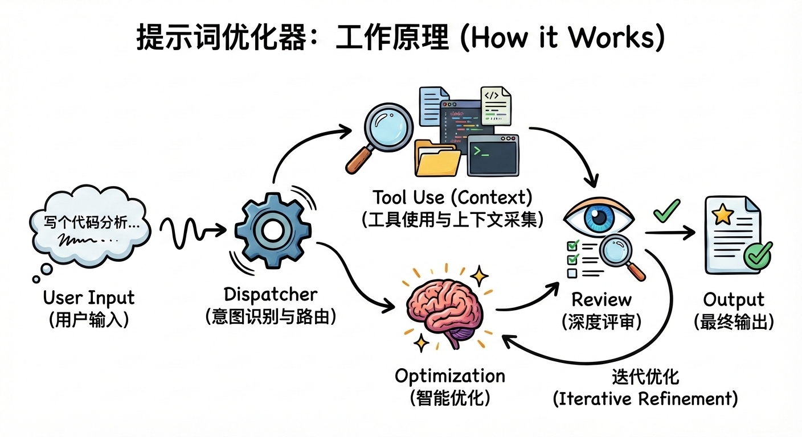

[English](README.md) | 中文

# Prompt Optimizer

一个基于 **Project Context** 进行 **Prompt优化** 的 Claude Code SKILL。

## 功能特性

- **智能优化**：自动检测提示词复杂度，应用合适的优化策略
- **清晰评估**：获得 0-100 分的评分，以及具体的优缺点反馈
- **迭代改进**：通过针对性指令持续优化提示词
- **即用输出**：优化后的提示词格式化呈现，可直接复制使用

## 安装

### 一键安装

**macOS/Linux:**
```bash
curl -fsSL https://raw.githubusercontent.com/geq1fan/prompt-optimizer-skill/main/install.sh | bash
```

**Windows (PowerShell):**
```powershell
irm https://raw.githubusercontent.com/geq1fan/prompt-optimizer-skill/main/install.ps1 | iex
```

### 手动安装

```bash
# 克隆到 Claude Code skills 目录
git clone https://github.com/geq1fan/prompt-optimizer-skill ~/.claude/skills/prompt-optimizer-skill
```

### 更新

```bash
# macOS/Linux
~/.claude/skills/prompt-optimizer-skill/install.sh update

# Windows
& "$env:USERPROFILE\.claude\skills\prompt-optimizer-skill\install.ps1" -Action update
```

## 使用方法

### 优化提示词

```
/optimize-prompt 写一个解析JSON的函数
```

### 迭代改进

```
/optimize-prompt iterate 添加错误处理要求
```

## 工作原理



1. **分析**：检查提示词的清晰度、完整性和结构
2. **策略选择**：根据复杂度选择优化方案
3. **增强**：在保持原意的同时进行针对性改进
4. **评估**：提供可操作的反馈和评分

## 贡献

欢迎贡献！你可以：
- 报告问题
- 提出改进建议
- 提交 Pull Request

## 许可证

MIT License

## 致谢

灵感来源于 [linshenkx/prompt-optimizer](https://github.com/linshenkx/prompt-optimizer)。
